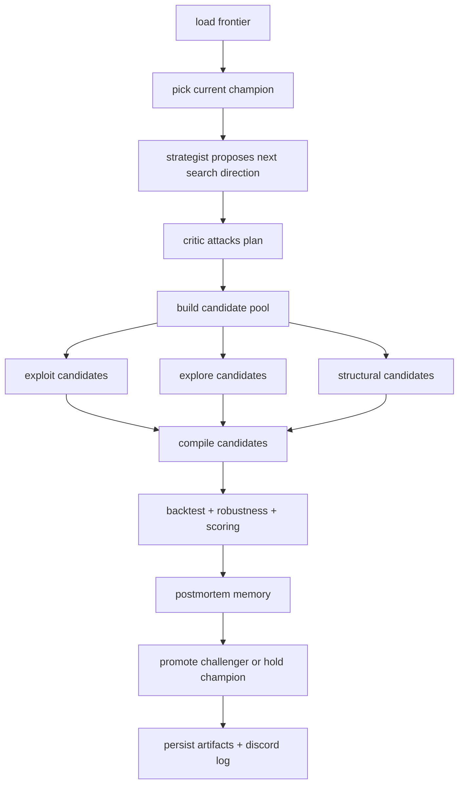
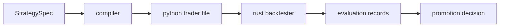

# prosperity explained

this repository is a local strategy research engine for imc prosperity.

it is built to do two jobs at the same time:

1. help humans iterate quickly on trading ideas
2. let the machine keep searching on its own without turning into random code spam

the core philosophy is simple:

- keep a strong current champion
- search nearby on purpose
- spend some budget exploring new families
- spend some budget on bigger structural jumps
- only replace the champion if a challenger actually wins

---

## the 30 second version

the repo has:

- preserved baseline bots
- a structured strategy spec format
- a deterministic compiler from spec -> python trader
- a rust backtester wrapper
- evaluation, robustness, novelty, and plagiarism checks
- a conversation-style ai research loop
- discord logging
- dashboard and artifacts

the loop does this:



---

## mental model

think of the repo as four layers:

| layer | job | examples |
|---|---|---|
| research memory | remembers what happened before | sqlite db, reports, postmortems |
| idea layer | decides what to try next | strategist, critic, frontier, mutation |
| execution layer | turns ideas into runnable bots | `StrategySpec`, compiler, templates |
| validation layer | tells us if the bot is real or fake-good | rust backtester, robustness, plagiarism guard |

the ai does not just write random trader files over and over.

instead:

- the ai proposes *structured search moves*
- the system mutates structured specs
- the compiler writes deterministic code
- the backtester decides what survives

that separation is why the repo stays sane.

---

## where the important files live

### top level

| path | purpose |
|---|---|
| `README.md` | quickstart and commands |
| `EXPLAIN.md` | this document |
| `AGENTS.md` | repo instructions for future codex sessions |
| `submission_candidate.py` | current strong hand-tuned local winner family |
| `baselines/` | preserved legacy strategies |
| `config/` | local config |
| `artifacts/` | compiled bots, reports, runs, packaged submissions |
| `data/` | db, corpora, caches, processed notes |

### package code

| path | purpose |
|---|---|
| `src/prosperity/orchestration/conversation.py` | main ai conversation loop |
| `src/prosperity/compilation/` | compiles specs into trader python files |
| `src/prosperity/generation/family_registry.py` | seed families |
| `src/prosperity/dsl/schema.py` | strategy spec schema |
| `src/prosperity/dsl/mutators.py` | local and structural mutation operators |
| `src/prosperity/dsl/crossover.py` | recombination between families |
| `src/prosperity/backtester/` | rust backtester wrapper + parser |
| `src/prosperity/evaluation/` | metrics, scoring, novelty, robustness, plagiarism |
| `src/prosperity/external/discord_notifier.py` | discord embed logging |
| `src/prosperity/cli.py` | terminal entrypoints |
| `src/prosperity/db/` | sqlite models and persistence |

---

## how a strategy is born

there are three main sources of candidates each cycle.

### 1. exploit candidates

these are local mutations around the current champion.

examples:

- slightly reduce `quote_aggression`
- slightly widen `tomato_take_width`
- slightly raise `tomato_filter_volume`
- slightly change signal weights

this is the safe hill-climbing part.

### 2. explore candidates

these come from other good families in the frontier.

the repo keeps a multi-family frontier, not just one line of descent.

right now the frontier is seeded with families like:

- `tutorial_submission_candidate_alpha`
- `tutorial_microprice_reversion`
- `tutorial_wall_mid_mm`

the loop can mutate those alternate parents too, not just the champion.

this is how the search avoids collapsing into one narrow local optimum.

### 3. structural candidates

these are bigger moves.

they are not just tiny parameter jitters.

examples:

- low-turnover shell
- inventory hardening shell
- signal rotation
- aggressive repricing shell
- crossover between an alternate family and the champion

this is the part that gives the loop a chance to discover a different regime, not just a slightly tweaked clone.

---

## what the ai roles actually do

the repo uses a fixed conversation, not free-form chaos.

### strategist

job:

- choose a small thesis for the next search step
- pick which parameters to move
- suggest up / down / neutral directions

example:

- reduce aggressiveness
- increase tomato filter volume
- keep micro signal roughly stable

### critic

job:

- attack the strategist plan
- point out overfit, inventory traps, and bad interaction effects
- tell the search what not to move too hard

this role is very high leverage because it prevents dumb search moves.

### mutator

job:

- turn plans into actual candidate specs
- generate exploit / explore / structural buckets

### evaluator

job:

- compile candidates into python traders
- run the rust backtester
- run robustness checks
- compute scores

### postmortem

job:

- summarize what happened
- write down what to try again and what to avoid

### promoter

job:

- compare best challenger vs champion
- promote only if the challenger truly clears the gate

---

## what “promote” means and why the loop can still say “hold”

this confuses people at first.

there are two gates.

### inner gate: candidate quality gate

this asks:

- is the candidate good enough on its own?
- does it pass score threshold?
- is plagiarism risk low enough?

if yes, the candidate can be marked internally as `promote`.

### outer gate: champion gate

this asks:

- did the candidate actually beat the current champion by enough?

if no, the overall cycle still says `hold`.

so this can happen:

- candidate = decent
- candidate = internally promotable
- champion = still better
- cycle decision = hold

that is normal and healthy.

---

## how strategy code is actually produced

the code path is:



important detail:

the ai loop does **not** directly freestyle a raw submission file every cycle.

instead:

- the ai changes structured specs
- the compiler writes the actual trader code
- the compiler uses internal templates and primitives

this is intentional:

- more reproducible
- less plagiarism risk
- easier to debug
- easier to compare behaviorally

---

## the current smart part of the search

the strongest current lineage is the family anchored on the local winner derived from `submission_candidate.py`.

that family focuses on:

- stable `EMERALDS` market making
- `TOMATOES` short-horizon order-book alpha
- filtered fair value
- second-level imbalance
- gap asymmetry
- return fade
- microprice fade
- inventory-aware execution

the loop now searches around that strong family, but it also keeps alternate frontier families alive.

that combination is important:

- too much exploitation = stuck
- too much exploration = noisy junk
- the current loop does both on purpose

---

## how the frontier works now

the frontier is a set of strong representatives from different families.

it is used for two jobs:

1. choose the best current champion
2. provide alternate parents for exploration and crossover

the repo keeps the frontier multi-family on purpose.

that means a cycle can:

- exploit the champion
- probe a microprice family
- probe a wall-mid family
- build a crossover hybrid

all in one pass

instead of spending the entire budget nudging one family forever.

---

## explore vs exploit budget

the loop now has an explicit per-cycle budget split:

- exploit budget
- explore budget
- structural budget

example default:

- exploit: 4
- explore: 2
- structural: 2

total:

- 8 candidates per cycle

why this matters:

- exploit keeps the strong local climb alive
- explore keeps alternate families in play
- structural gives the loop a chance to jump regimes

this is much better than a pure hill-climber.

---

## how robustness is measured

the repo does not trust raw pnl alone.

it also runs:

- base backtest
- slippage perturbation
- queue penetration perturbation

then it records a robustness score.

so a candidate that prints money only under ideal fills gets penalized.

this is one of the main protections against fake alpha.

---

## how memory works

the loop remembers three kinds of things:

### 1. conversation cycles

one record per loop cycle:

- champion before
- champion after
- best candidate
- decision

### 2. conversation messages

one record per role turn:

- strategist
- critic
- evaluator
- postmortem
- promoter

### 3. memory notes

distilled lessons like:

- “robust but weaker”
- “too aggressive”
- “inventory trap risk”
- “good pnl but still under champion”

this prevents the loop from forgetting everything every iteration.

---

## where the discord logs come from

after each cycle, the loop can send a discord embed with:

- short strategy sentence
- pnl vs champion
- key stats
- system health
- decision

that is generated from the cycle summary, not from random text.

so the log message is consistent with the actual run record.

---

## the commands that matter most

### run one cycle

```bash
python3 -m prosperity.cli loop cycle
```

### run forever until ctrl-c

```bash
python3 -m prosperity.cli loop run
```

### run exactly n cycles

```bash
python3 -m prosperity.cli loop run --cycles 10
```

### preview latest discord message

```bash
python3 -m prosperity.cli discord latest
```

### send latest discord message now

```bash
python3 -m prosperity.cli discord latest --send
```

### run the preserved baseline

```bash
python3 -m prosperity.cli baselines run legacy_newalgo --dataset submission
```

---

## if you are trying to answer “who is doing what?”

here is the clean answer.

### codex in chat

does:

- architecture
- repo changes
- debugging
- tuning the platform itself
- strategic intervention when you ask for it

### the local ai loop

does:

- propose next search moves
- critique them
- generate candidate specs
- compile them
- evaluate them
- log and remember what happened

### the backtester

does:

- ground truth for local empirical validation

### the promotion gate

does:

- stop bad challengers from replacing good champions

---

## what this repo is good at right now

- strong local search around a real winning family
- stable champion-challenger promotion
- multi-family frontier exploration
- structural mutation, not just tiny jitter
- reproducible artifacts
- good observability

## what still matters most for better alpha

- more real data
- better regime coverage
- smarter structural families over time
- stronger human steering when the loop plateaus

in other words:

this repo is a strong search engine, not magic.

it gives you disciplined iteration, memory, and validation.
that is exactly what you want if the goal is to compound edge rather than chase noise.
